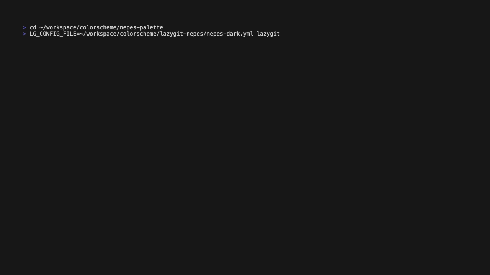
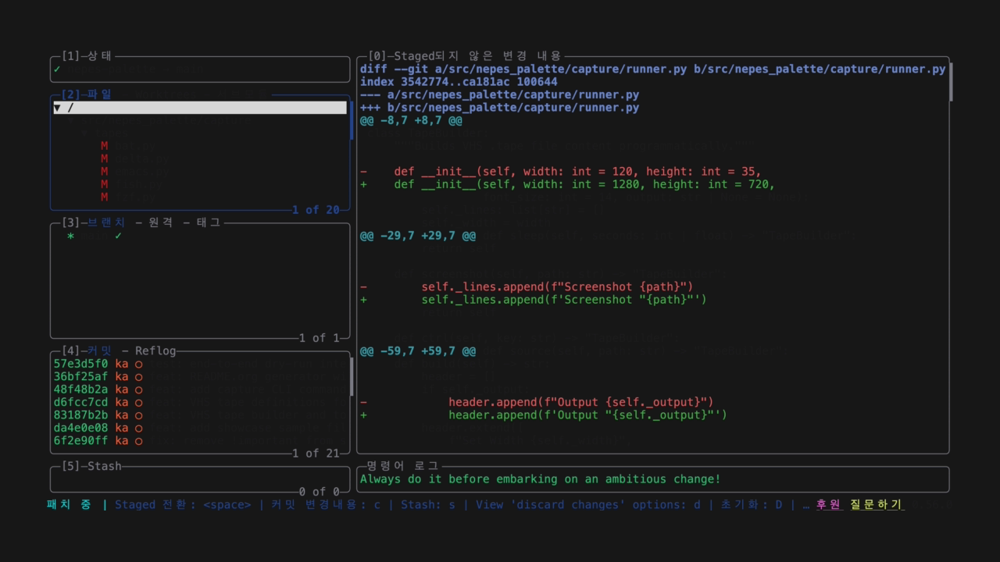
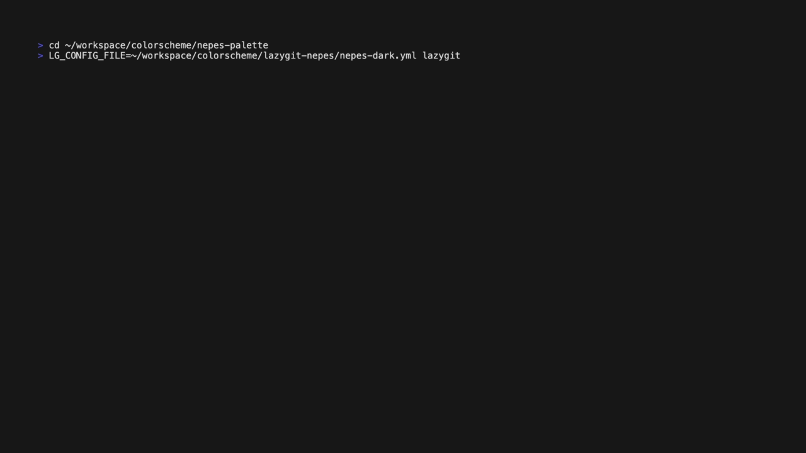
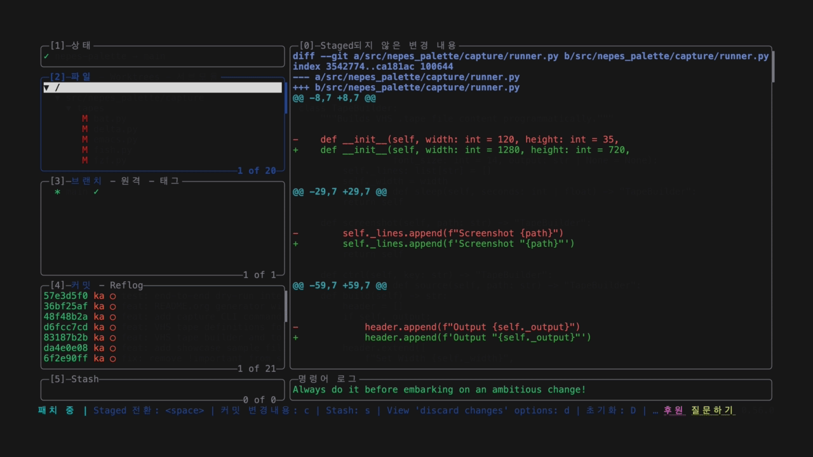

#+title: lazygit-nepes
#+description: Nepes color theme for lazygit

Terminal UI for git commands.

Part of the [[https://github.com/kayspark][Nepes Colorscheme]] suite.

* Screenshots

| Dark | Light |
|------+-------|
|  |  |

** Demo

| Dark | Light |
|------+-------|
|  |  |

* Installation

1. Clone this repo
2. Copy theme YAML to =~/.config/lazygit/=
3. Set =LG_CONFIG_FILE= to the theme path

* Configuration

#+begin_src shell
LG_CONFIG_FILE=~/.config/lazygit/nepes-dark.yml lazygit
#+end_src

* Credits

Generated by [[https://github.com/kayspark/nepes-palette][nepes-palette]].
